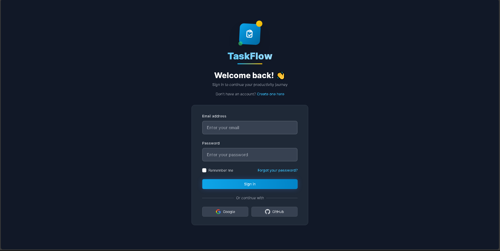
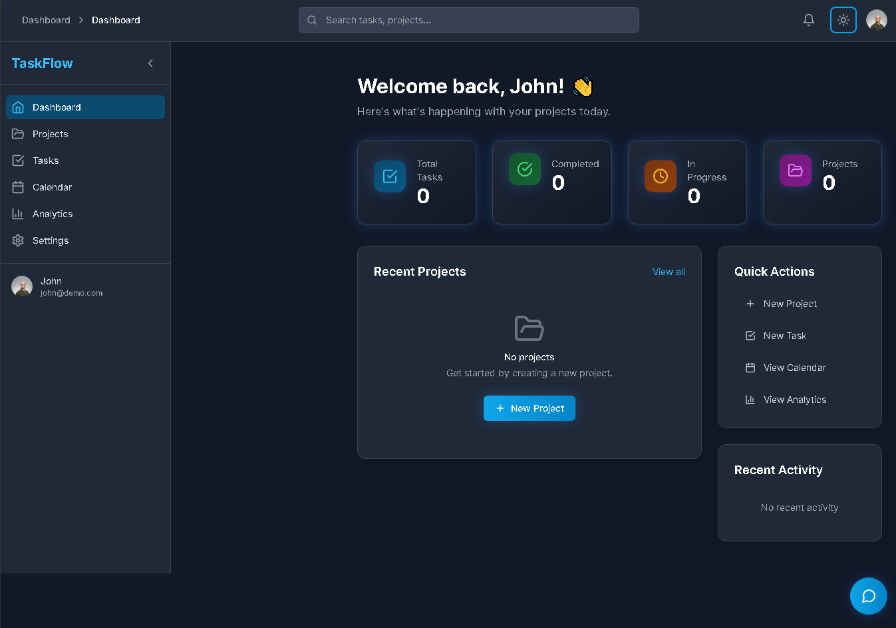
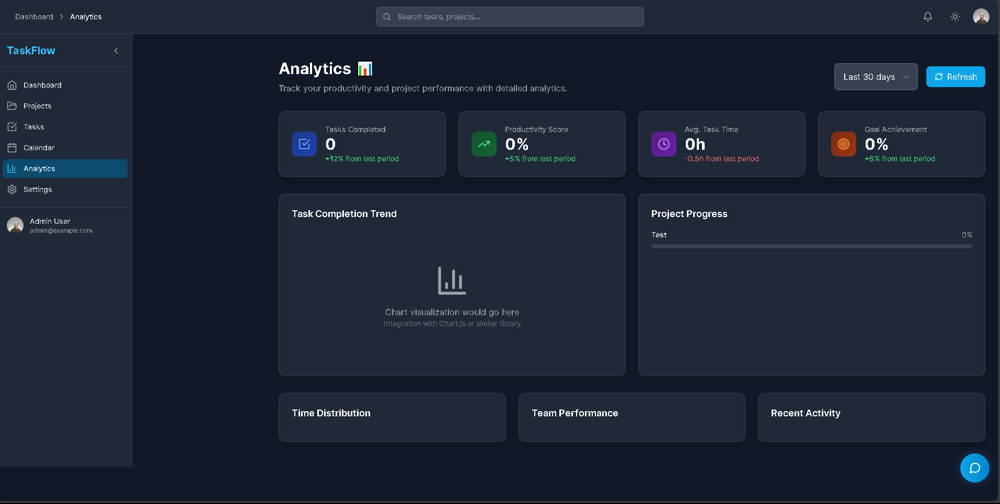
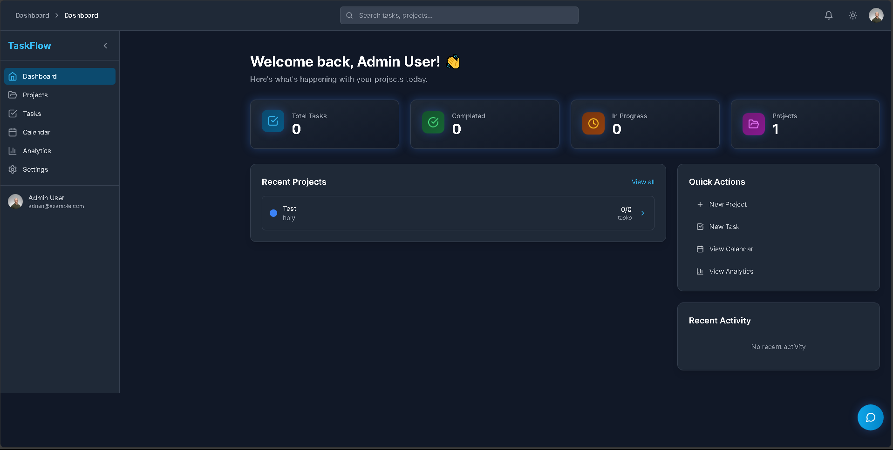

---

# 3️⃣ **Task Management App** README  
📍 Repo: `Task_managment`

## Screenshots

### Authentication & Access


### Task & Project Management



### Admin & Role Management



```markdown
# Task Management App

A real-time collaborative task management platform designed for team-based workflows.

## 🔐 Demo Login Credentials

Use the following accounts to explore the application without signing up:

| Role  | Email              | Password     |
|------|--------------------|--------------|
| Admin | admin@example.com | password123 |
| User  | john@demo.com     | password123 |
| User  | jane@demo.com     | password123 |
| User  | mike@demo.com     | password123 |
> These demo accounts showcase role-based access control and real-time collaboration features.

## 🚀 Live Demo
https://task-managment-mauve.vercel.app

## 📌 About
This application allows teams to create projects, assign tasks, and collaborate in real time. It was built to explore WebSocket communication, role-based access control, and multi-user state synchronization.

## ⚙️ Key Features
- Live updates using Socket.io
- Role-based access control (RBAC)
- Project and task organization

## 🛠 Tech Stack
**Frontend:** Vue.js  
**Backend:** Node.js, Express.js  
**Database:** MySQL  
**Other:** Socket.io, REST APIs, Session Auth

## 🧠 Challenges Solved
- Maintaining consistent real-time state across users
- Designing permission-safe API endpoints

## 🚀 Getting Started
```bash
git clone https://github.com/Turbo9k/Task_managment.git
cd Task_managment
npm install
npm run dev
